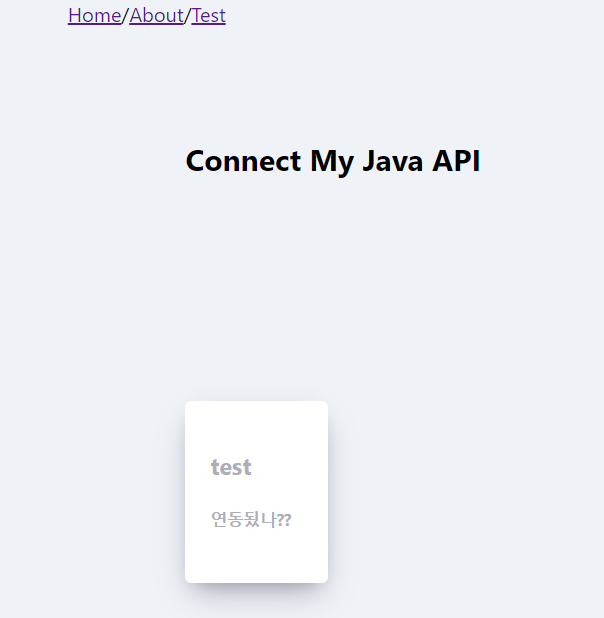

# Spring API Server와 React 연동
> WAS API서버와 React Axios를 통한 연동

```bash
//react-movie_app 실행
npm install
npm start
```


##### 2개 프로젝트를 합친 프로젝트

* [react-movie_app](https://github.com/kyun9/react-movie_app) : 간단한 API연결 React 프로젝트
  * 포트 3000
* [spring-mvc-swagger](https://github.com/kyun9/spring-mvc-swagger) : Swagger이용한 RESTfull API문서 프로젝트
  * 포트 9000


